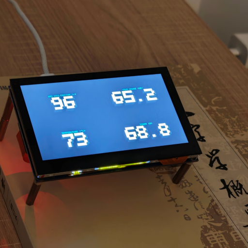

# bvtop

A minimal GPU monitor for viewing over SSH on small screens.



## Motivation

[nvtop](https://github.com/Syllo/nvtop) is excellent but information-dense — hard to read from a distance on a small display. bvtop shows just four numbers in large block digits, readable from across the room.

## Usage
```bash
./bvtop
# Press q to quit
```

## Constraints

- **Single GPU only.** Refuses to start if zero or multiple GPUs are detected.
- **Single process only.** Refuses to start if the GPU has zero or more than one compute process.
